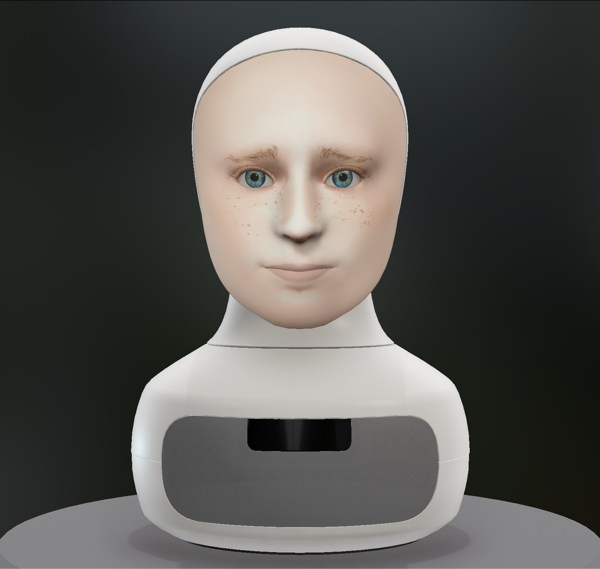
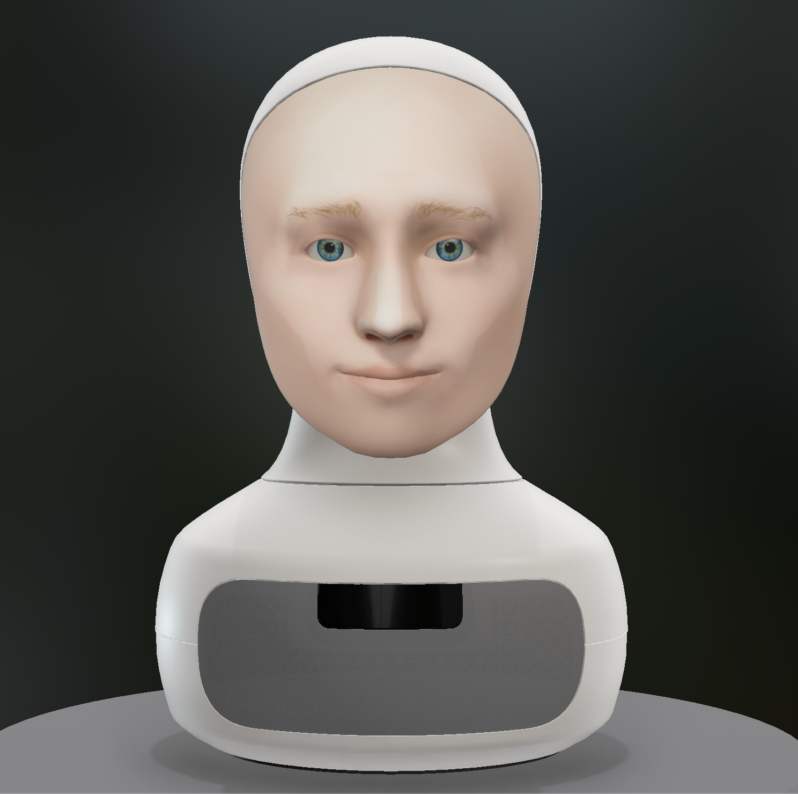
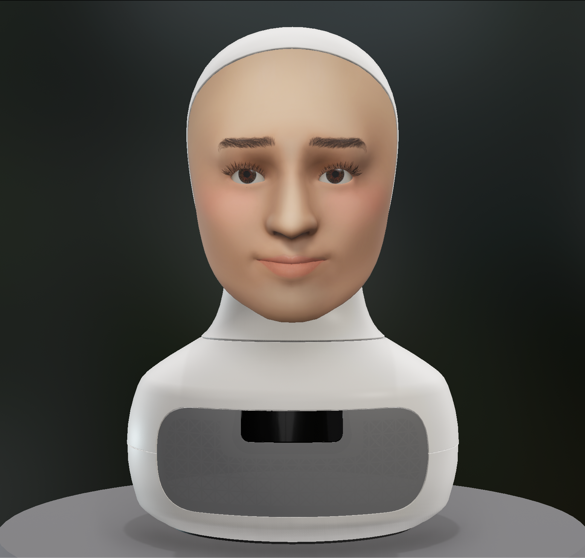
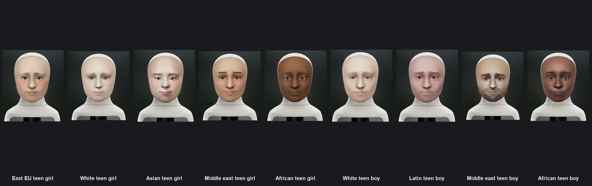
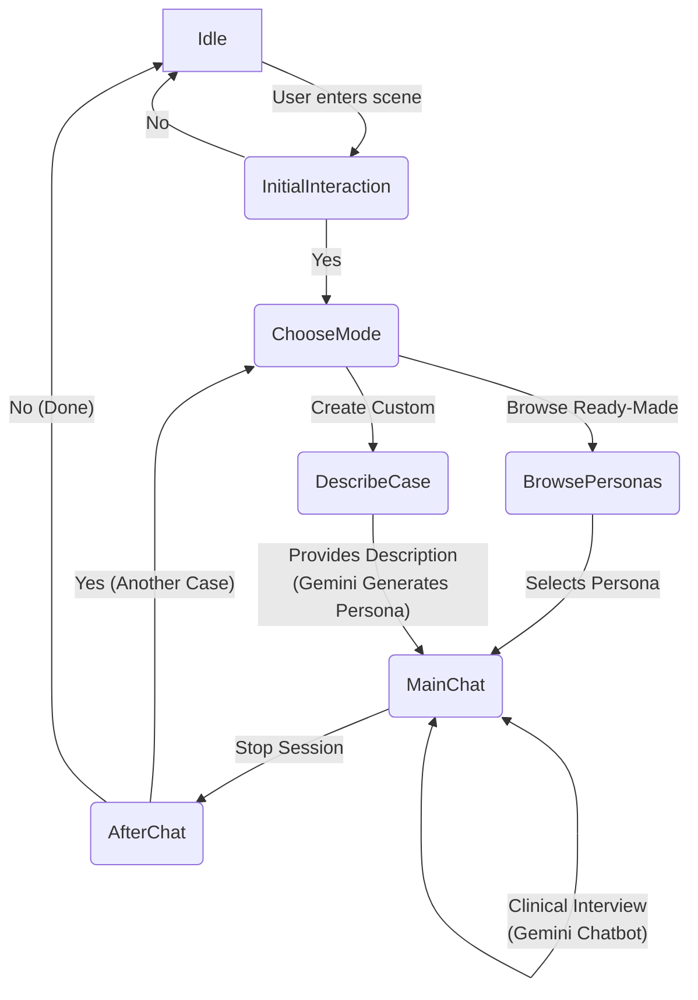

# Furhat Child Psychiatry Simulation

▶ Demos: [Pre-made persona](media/demo-premade.mp4) · [Custom persona](media/demo-custom.mp4)

A FurhatOS skill designed for training child and adolescent psychiatry interview skills. This robotic simulation provides lifelike AI-powered pediatric patients with distinct psychological profiles, allowing clinicians and medical students to practise clinical interviews in a safe, repeatable, and realistic environment.

## 🚀 Features

- **Pre-Made Clinical Cases:** The system comes with 7 built-in, ready-to-use patient personas with varied clinical presentations (e.g., social anxiety, depression, perfectionism) and difficulties.
- **Dynamic Case Generation:** Clinicians can also describe any custom patient profile (e.g., "15-year-old boy struggling with ADHD and school refusal"). The system leverages Google Gemini to generate a complete persona on the fly—including name, backstory, clinical symptoms, personality traits, and a custom system prompt.
- **Hybrid Intent Matching:** Navigates conversation states using a fast, two-tier pipeline:
  1. Low-latency keyword matching for standard commands (e.g., "stop session", "yes/no").
  2. LLM-based intent classification via Gemini when complex user utterances don't match simple keywords.

## 🧠 Clinical Cases

The simulation includes 7 built-in patient personas. Each patient speaks with a condition-appropriate emotional tone, displays real-time facial expressions in sync with their speech, and is paired with a matching Furhat face, mask, and ElevenLabs voice based on their age, gender, and cultural background.

| Face | Name | Demographics | Clinical Presentation |
|---|---|---|---|
|  | **Ella** | 12F, Finnish | Social anxiety |
|  | **Lauri** | 14M, Finnish | Depression |
|  | **Emmi** | 8F, Finnish | Separation anxiety |
|  | **Mei** | 10F, Chinese | Generalized anxiety |
|  | **Asha** | 15F, Indian | Perfectionism and anxiety |
|  | **Carlos** | 17M, Mexican | Masked depression |
|  | **Dmitri** | 16M, Russian | Irritable depression |

Clinicians can also describe any custom patient profile in natural language (e.g., "15-year-old boy struggling with ADHD and school refusal"). The system uses Gemini to generate a complete persona on the fly and automatically assigns the appropriate face, mask, and voice.



## 🔄 Conversation Flow

The simulation follows a structured state machine flow to guide users from setup to the clinical interview.


```mermaid
graph TD
    A[Idle] -->|"User enters scene"| B(InitialInteraction)
    B -->|"Yes"| C(ChooseMode)
    B -->|"No"| A
    C -->|"Browse Ready-Made"| D(BrowsePersonas)
    C -->|"Create Custom"| E(DescribeCase)
    D -->|"Selects Persona"| F(MainChat)
    E -->|"Provides Description\n(Gemini Generates Persona)"| F
    F <-->|"Clinical Interview\n(Gemini Chatbot)"| F
    F -->|"Stop Session"| G(AfterChat)
    G -->|"Yes (Another Case)"| C
    G -->|"No (Done)"| A
```

## 🛠️ Prerequisites

- **Hardware/Software:** Furhat robot or the local FurhatOS simulator
- **API Keys:** 
  - [Google Gemini API Key](https://aistudio.google.com/app/apikey) for LLM generation/classification
  - [ElevenLabs API Key](https://elevenlabs.io/) for high-quality TTS voices
- **Environment:** 
  - JDK 15 (set `org.gradle.java.home` in your `gradle.properties`)

## ⚙️ Setup and Installation

1. **Clone the repository:**
   ```bash
   git clone https://github.com/dara-nn/Furhat-Child-Psychiatry-Simulation.git
   cd Furhat-Child-Psychiatry-Simulation
   ```

2. **Configure API Keys:**
   Create a `local.properties` file in the project root:
   ```properties
   gemini.api.key=YOUR_GEMINI_KEY
   ```

3. **Set your local JDK path:**
   Create or edit `gradle.properties` in the project root:
   ```properties
   org.gradle.java.home=/path/to/your/jdk-15
   ```

4. **Build the Skill:**
   ```bash
   ./gradlew shadowJar
   ```
   This compiles the project and produces a `.skill` file (e.g., `PsychiatrySimulation_1.1.0.skill`) in `build/libs/`.

5. **Deploy:**
   Upload the compiled `.skill` file via the Furhat web dashboard and launch it.

## 📂 Project Structure

```
src/main/kotlin/furhatos/app/openaichat/
├── flow/
│   ├── chatbot/        # Gemini LLM integration and dynamic case generation
│   ├── main/           # Core conversation states (Greeting, Choose Mode, Idle)
│   ├── keywords.kt     # Hardcoded keyword lists for fast intent matching
│   └── parent.kt       # Shared state behaviour and background gestures (e.g., gaze aversion)
└── setting/
    └── persona.kt      # Persona data structures and Face/Voice activation logic
```

## 🙏 Acknowledgements

- Built on [FurhatOS](https://furhatrobotics.com/)
- Powered by [Google Gemini](https://deepmind.google/technologies/gemini/)
- Voices by [ElevenLabs](https://elevenlabs.io/)
